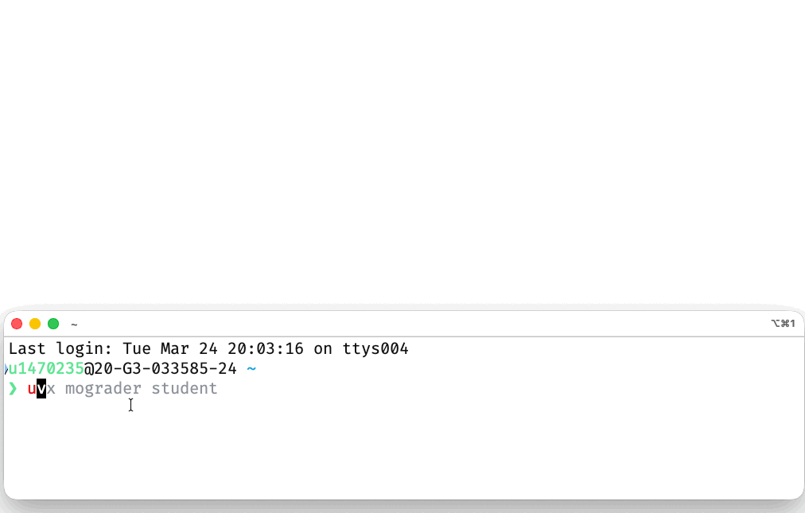

# Student Setup Guide

<p align="center">
  
</p>

There are five ways to work on assignments. Pick whichever suits you best:

| | **Hub** | **Desktop app** | **Local install** | **GitHub Codespaces** | **Molab** |
|---|---|---|---|---|---|
| Setup | None | Download installer | Install uv (2 commands) | One click | None |
| Platforms | Any browser | Windows, macOS, Linux | macOS, Linux, Windows | Any browser | Any browser |
| Best for | No install needed | No-terminal workflow | Full offline workflow | Windows users, quick start | Light editing, no install |
| Validate | Yes | Yes | Yes | Yes | Via assessment cell |

## Option 0: Hub (browser-based)

If your instructor has set up a hub server, assignments are available directly in your browser — no installation required.

1. Go to the hub URL provided by your instructor
2. Log in via your university SSO
3. Click **Download** to fetch the assignment
4. Click **Edit** to open it in the marimo editor
5. Work on the assignment in your browser
6. Click **Validate** to check your work
7. Click **Export** to download the completed `.py` notebook
8. Upload the exported file to Moodle for submission

!!! note
    Some assignments may include hidden tests that are only checked during
    final grading. Exported files must be uploaded to Moodle for submission.

## Option 1: Desktop app

Download and run the installer — no terminal or Python needed.

1. Download the installer for your platform from the [latest release](https://github.com/jameskermode/mograder-tauri/releases/latest):
   - **Windows:** `.exe` (per-user install, no admin required)
   - **macOS:** `.dmg`
   - **Linux:** `.AppImage`
2. Launch the app and paste the **course configuration URL** provided by your instructor
3. The app downloads everything automatically and opens the student dashboard

!!! warning "Unsigned app warnings"
    **Windows:** SmartScreen may show "Windows protected your PC" — click **More info** → **Run anyway** (the app is not yet code-signed).

    **macOS:** Right-click the app and choose **Open** on first launch (unsigned app).

## Option 2: Local install

### macOS / Linux

```bash
# 1. Install uv (one time)
curl -LsSf https://astral.sh/uv/install.sh | sh

# 2. Launch the student dashboard (first time — uses URL)
uvx mograder student <CONFIG_URL>
```

Your instructor will provide the `<CONFIG_URL>` (a link to the course's `mograder.toml` file).

!!! tip "Try the demo"
    To try mograder without a real course, use the public demo server:
    `uvx mograder student https://mograder-demo.jrkermode.uk/mograder.toml`

### Windows (PowerShell)

```powershell
# 1. Install uv (one time)
powershell -ExecutionPolicy ByPass -c "irm https://astral.sh/uv/install.ps1 | iex"
```

**Restart your terminal**, then:

```powershell
# 2. Launch the student dashboard (first time — uses URL)
uvx mograder student <CONFIG_URL>
```

!!! tip
    If you have trouble with the Windows install, try the [Desktop app](#option-1-desktop-app) which provides a point-and-click installer with no terminal needed, or [GitHub Codespaces](#option-3-github-codespaces) which works entirely in your browser with no local setup.

### Returning sessions (all platforms)

After the first run, a course directory is created for you. Just `cd` into it and run:

```bash
cd <course-directory>
uvx mograder student
```

The dashboard will automatically fetch the latest assignment list.

### What is uv?

[uv](https://docs.astral.sh/uv/) is a fast Python package manager. The `uvx` command runs Python tools without needing to install them globally — it creates a temporary environment, installs mograder and its dependencies, and launches the dashboard. No virtual environments or `pip install` needed.

### Platform details

- **macOS / Linux**: The `curl` command installs uv to `~/.local/bin`. You may need to restart your shell or run `source ~/.bashrc` (or `~/.zshrc`) for the `uvx` command to be available.
- **Windows**: After running the PowerShell installer, you **must** restart your terminal for `uvx` to be on your PATH.

## Option 3: GitHub Codespaces

GitHub Codespaces gives you a full development environment in your browser — no local install needed.

### Getting started

1. Your instructor will provide a Codespaces link (e.g. `https://codespaces.new/<org>/<repo>`)
2. Click the link and choose **Create codespace**
3. Wait for the environment to build (takes ~1 minute the first time)
4. The student dashboard starts automatically — open port **2718** in the Ports tab or click the link in the terminal

### How editing works

In Codespaces, notebooks open in **headless mode**: marimo runs in the background and you edit in a new browser tab via port forwarding. The dashboard handles this automatically when you click **Edit**.

### Managing usage

GitHub gives free accounts **120 core-hours/month** of Codespaces time. To avoid wasting hours:

- **Stop your Codespace** when you're done: click your profile picture (top-right on github.com) → **Your codespaces** → **...** → **Stop codespace**
- **Reopen later**: go to [github.com/codespaces](https://github.com/codespaces) and click on your existing Codespace — it resumes where you left off
- **Check usage**: go to **Settings** → **Billing and plans** → **Codespaces** to see remaining hours

Codespaces automatically stop after 30 minutes of inactivity. Your work is saved until the Codespace is deleted (default: after 30 days of inactivity).

## Option 4: Molab (cloud)

If you're using [Molab](https://molab.marimo.io), no local installation is required:

1. Download the `.py` notebook file from Moodle (or your course's HTTPS server)
2. Upload the file to Molab
3. Molab automatically installs dependencies from the notebook's inline metadata
4. Work on the notebook in your browser
5. Download the completed `.py` file from Molab
6. Submit via the Moodle web interface or `mograder https submit`

!!! note
    Molab does not support the mograder **Validate** button, but you can still check your work before submitting. Each assignment notebook contains a self-assessment cell near the end — run it to see which checks pass or fail (e.g. "3/5 PASS"). This is the same information the Validate button shows; the button is just a convenience wrapper.

### Molab with HTTPS transport

If your course uses the mograder HTTPS transport (instead of Moodle), your instructor will provide a server URL and an enrollment code.

**Register via the student dashboard** (recommended): launch `uvx mograder student <CONFIG_URL>` and enter your username + enrollment code in the login form. Your token is generated on the server and cached at `~/.config/mograder/https_token.json`.

**Or cache a token from the CLI** if your instructor gave you one directly:

```bash
uvx mograder https login --token <YOUR_TOKEN> --url <SERVER_URL>
```

Then fetch and submit assignments via the CLI:

```bash
# Fetch the assignment notebook
uvx mograder https fetch "hw1" -o hw1/

# Upload to Molab, work on it, then download the completed file

# Submit your work
uvx mograder https submit "hw1" hw1/homework.py

# Check your status
uvx mograder https feedback "hw1"
```

Or set the URL in `mograder.toml` so you don't need `--url` every time:

```toml
transport = "https"

[https]
url = "https://your-course-server.example.com"
```

## Working on assignments

When the dashboard launches, log in with your credentials:

- **Moodle** courses — paste your Moodle security token (from your Moodle Security Keys page).
- **HTTPS transport** courses — enter your username and the enrollment code provided by your instructor to register. You can also paste a token directly if your instructor gave you one. Credentials are cached locally so you only need to do this once.

The dashboard shows your course assignments with status tracking and action buttons:

- **Download** — downloads the assignment `.py` file into a local subdirectory
- **Edit** — opens the notebook in marimo for editing (launches `marimo edit --sandbox`)
- **Validate** — runs the notebook's checks locally and shows results (e.g. "3/5 PASS") with an inline HTML report
- **Submit** — uploads your `.py` file and finalizes the submission

Assignment status updates automatically: **Downloaded** → **Submitted** (after submit) → **Modified** (if you edit after submitting). View grades and feedback directly on Moodle.

### Hidden tests and late submissions

Some assignments may include hidden tests that run during grading but are not visible in your notebook. Your feedback will show whether hidden tests passed or failed.

Assignments submitted after the deadline may receive a mark deduction. Your feedback will show the penalty applied and the reason.

### Opening notebooks directly

You can also work on notebooks without the dashboard:

```bash
marimo edit --sandbox notebook.py
```

The `--sandbox` flag tells marimo to read the PEP 723 inline metadata in the notebook and install dependencies automatically.

## Troubleshooting

### "command not found: uvx"

- Make sure you've installed uv (step 1 above)
- Restart your terminal after installing uv
- On macOS/Linux, check that `~/.local/bin` is on your PATH

### "Error: ... is not a directory"

Make sure you're either:
- Passing a URL for first-time setup: `uvx mograder student https://...`
- Running from inside the course directory: `cd <course> && uvx mograder student`

### Windows issues

If you experience problems with uv or marimo on Windows (PATH issues, permission errors, antivirus interference), consider using [GitHub Codespaces](#option-3-github-codespaces) as a hassle-free alternative.

### Network / proxy issues

If fetching the config fails behind a corporate proxy or firewall, ask your instructor for the `mograder.toml` file directly. Place it in a new directory and run `uvx mograder student` from that directory.

### "No assignments found"

Your instructor may not have published assignments yet. The dashboard refreshes the assignment list each time you launch it.
